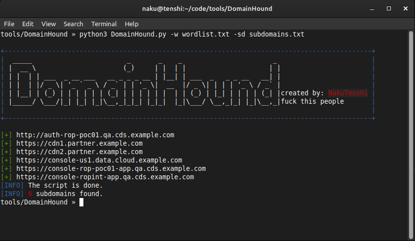

# DomainHound 🐺


**DomainHound** is a simple yet powerful Python tool designed to filter subdomains based on a custom wordlist.  
It helps bug bounty hunters, penetration testers, and security researchers quickly locate subdomains of interest from massive domain lists.

---

## 🔍 Features

- ✅ Filters subdomains using a keyword/wordlist
- ✅ Simple CLI interface with colorful terminal output
- ✅ Optional saving of results to a file
- ✅ Regular expression-based matching
- ✅ Clean and readable output

---

## 🛠️ Installation

Clone the repository:

```bash
git clone https://github.com/yourusername/DomainHound.git
cd DomainHound
```
---
## 🚀 Usage Example:
you need two wordlists to run this script
### wordlist(keywords.txt):
```
admin
test
dev
```
### Subdomains list (subdomains.txt):
```
admin.example.com
dev-api.example.com
login.example.com
example.com
```

### Command:
**Note:** Make sure you have Python 3 installed.

those both commands filters all subdomains in subdomains.txt that contain any word from keywords.txt

```bash
python3 domainhound.py -w keywords.txt -sd subdomains.txt
```
or
```bash
python3 domainhound.py -w keywords.txt -sd subdomains.txt -o filtered.txt
```


### Arguments:

| Argument | Description |
|----------|-------------|
| `-w`     | Path to the wordlist (keywords) used for filtering |
| `-sd`    | Path to the subdomain list you want to filter |
| `-o`     | (Optional) Path to save the output |

If -o is provided, the output will be saved to the given path and If -o does not used, matches will be printed directly to the terminal with color formatting.

---
**Created by:** NakuTenshi
